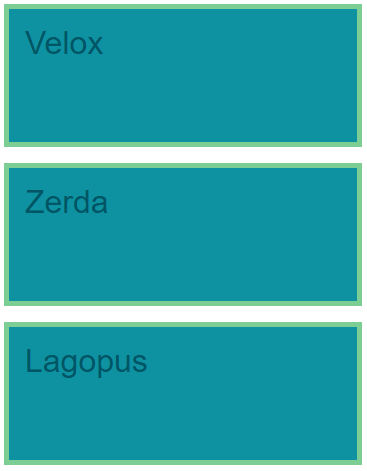
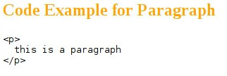
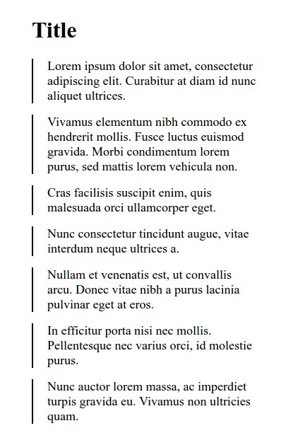

# HTML & CSS

Create small layouts with HTML and CSS.

## Objectives

- Using classes and ids
- Understanding sizes and the box-model in CSS
- Using borders

## Materials & Resources

### Training

#### HTML

| Material                                                                                                |  Time |
| :------------------------------------------------------------------------------------------------------ | ----: |
| [HTML Tutorial for Beginners 05 - Head and Body Tag](https://www.youtube.com/watch?v=mNRzWMH5xK0)       |  7:22 |
| [HTML Tutorial for Beginners 10 - HTML Links](https://www.youtube.com/watch?v=f8pAb3IuECk)              | 12:24 |
| [HTML Tutorial for Beginners 13 - The div Tag](https://www.youtube.com/watch?v=-XQlr727A8w)             |  4:51 |
| [HTML Tutorial for Beginners 14 - ID's and Classes](https://www.youtube.com/watch?v=9UNmumTYuq8)        |  8:13 |

#### CSS

| Material                                                                                                     |  Time |
| :----------------------------------------------------------------------------------------------------------- | ----: |
| [CSS Tutorial For Beginners 08 - Targeting Elements with CSS](https://www.youtube.com/watch?v=f7c7bTrqXic)   |  4:28 |
| [CSS Tutorial For Beginners 09 - Targeting Classes and ID's](https://www.youtube.com/watch?v=hrqo_GOwHHs)    |  7:24 |
| [CSS Tutorial For Beginners 10 - CSS Conflicts & the Cascade](https://www.youtube.com/watch?v=4oPvurjpcNw)   |  8:04 |
| [CSS Tutorial For Beginners 11 - Inheritance](https://www.youtube.com/watch?v=ZMpaebQ3n6A)                   |  8:47 |
| [CSS Tutorial For Beginners 12 - Selector Specificty](https://www.youtube.com/watch?v=lZ6R_eYYxoE)           | 10:17 |
| [CSS Tutorial For Beginners 14 - Targeting Multiple Elements](https://www.youtube.com/watch?v=3SOf8gZlBhI)   |  4:40 |
| [CSS Tutorial For Beginners 15 - Descendant Selectors](https://www.youtube.com/watch?v=84KE7OwMjYY)          |  6:22 |
| [CSS Tutorial For Beginners 36 - The Box Model](https://www.youtube.com/watch?v=Qx-yzUBqatQ)                 |  9:27 |
| [CSS Tutorial For Beginners 37 - Margins](https://www.youtube.com/watch?v=ggo0di5L6sA)                       | 10:38 |
| [CSS Tutorial For Beginners 38 - Padding](https://www.youtube.com/watch?v=4YF-eaX4P0k)                       |  4:41 |
| [CSS Tutorial For Beginners 40 - Borders](https://www.youtube.com/watch?v=sdn5p4kf91c)                       |  6:47 |
| [CSS Tutorial For Beginners 41 - Block - inline - inline block](https://www.youtube.com/watch?v=HuiPIK-0-_A) | 11:08 |

### Optional

*If you've got time, consider the following:*

- <https://developer.mozilla.org/en-US/docs/Web/HTTP>
- <https://developer.mozilla.org/en-US/Learn/Getting_started_with_the_web/HTML_basics>
- <https://developer.mozilla.org/en-US/Learn/Getting_started_with_the_web/CSS_basics>
- <http://alistapart.com/article/grokwebstandards>

## Material Review

- Purpose of:
  - `<html>`
  - `<head>`
  - `<link>`
  - `<script>`
  - `<body>`
  - `<meta>`
  - `<title>`
  - `<h1>` - `<h6>`
  - `<p>`
  - `<a>`
  - ``
  - `<article>`
  - `<aside>`
  - `<strong>`
  - `<em>`
  - `<span>`
  - `<div>`
  - `<header>`
  - `<main>`
  - `<footer>`
  - `<section>`
  - `<ul>`
  - `<ol>`
  - `<li>`
  - `<dl>`
  - `<dd>`
  - `<dt>`
  - `<pre>`
- class
- id
- Descendant selector
- Conflict
- Inheritance
- Specificity
- The Box model
- Shorthand
- Default browser styles
- Display: inline
- Display: block
- Display: inline-block
- width & height

## Workshop

In the sections that follow are a list of Exercises for you to build using
simple layouts in HTML and CSS.

- Create each in its own, separate directory
- Try to use the most simple method when selecting the element
- Try to avoid duplicating code
- Use paint, gimp, irfanview or something similar to figure out the sizes and
  colors
- You can use any lorem ipsum generator for the texts, *it is not necessary to
  have the same text*

### Exercise 1



Font size: 36 pixels

### Exercise 2


Font size: 36 pixels

### Exercise 3


Font size: 36 pixels

### Exercise 4



### Exercise 5


### Exercise 6



Font size: 18 pixels

### Exercise 7

Given the following HTML structure:

```HTML
<div class="container">
  <div id="b325" class="asteroid">The King</div>
  <div class="asteroid b326">The Conceited Man</div>
</div>
<p class="asteroid big">The Businessman</p>
<div class="asteroid b329 big">The Lamplighter</div>
```

- make 'The Businessman' and 'The Lamplighter' blue colored
- add 'The King' and 'The Conceited Man' a 1 pixel wide green border each
- make 'The King', 'The Conceited Man' and 'The Lamplighter' bold
- add 'The Businessman' a yellow background

for each task, figure out the simplest selector possible.\
the result should look like this:


### Exercise 8


## Individual Workshop Review

Please follow the styleguide:
[Our HTML & CSS styleguide](../../styleguide/html-css.md)

- Is the directory structure and the name of the files correct?
- Is the doctype present and valid?
- Is the semantic structuring good in the html file?
- Are the color codes valid?
- Is there unnecessary code duplication?
- Is the indentation good in each file?
- Are the attributes valid on each tag?
- Are there unnecessary code or empty selectors?
- Are the `<ul>` and `<li>` elements valid?
- Are there id duplications?
- The code should not show errors here: <https://validator.w3.org/>
- Is the commit message meaningful?
