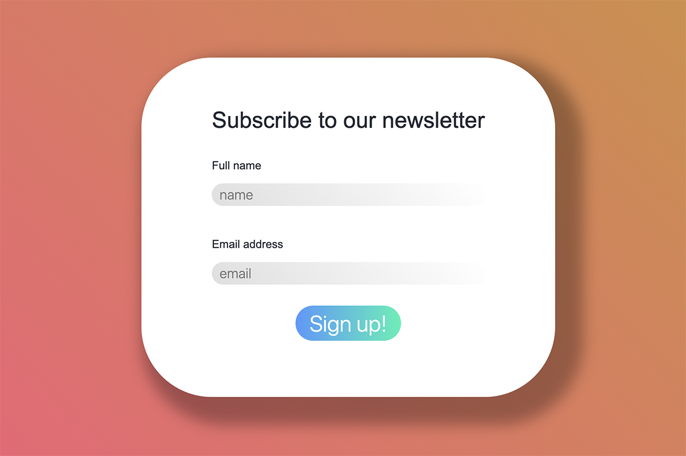

# Newsletter

## Frontend

- Create a simple form featuring two fields
  - Name (call it `username`)
  - Email (call it `email`)
- Both fields should be required via HTML5 form validation
- Try to implement the design above if you have time
