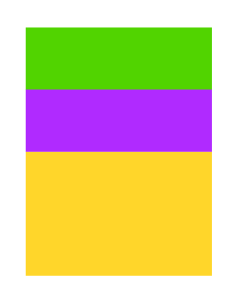
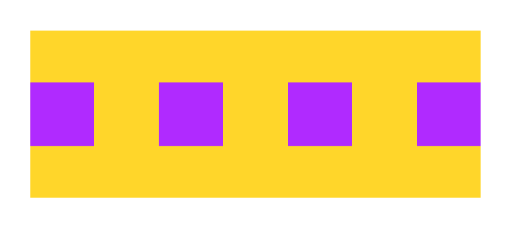
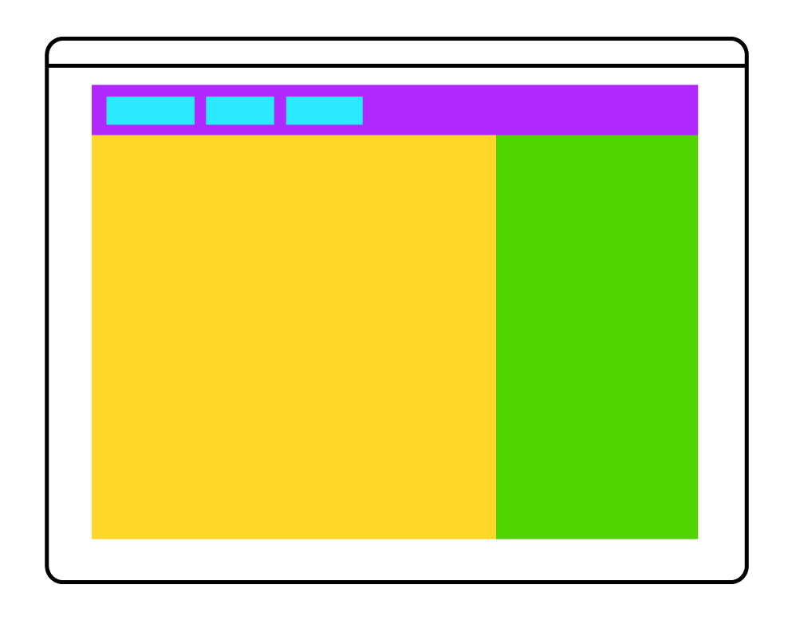
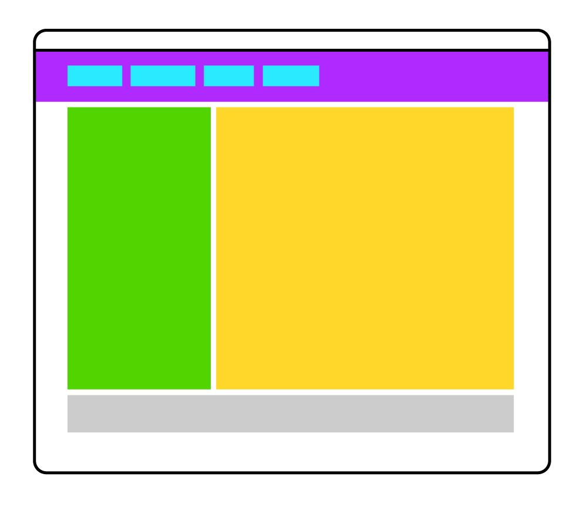
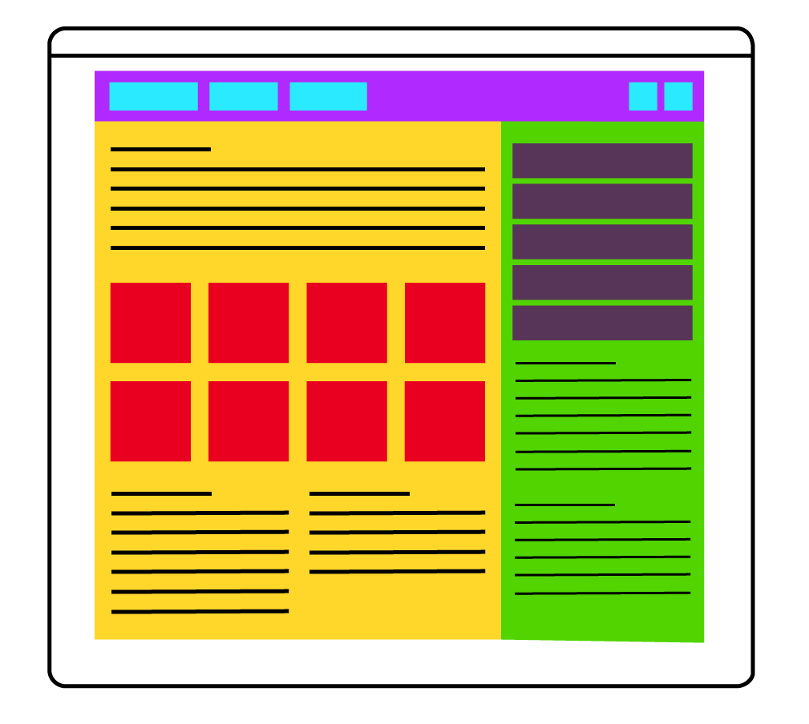
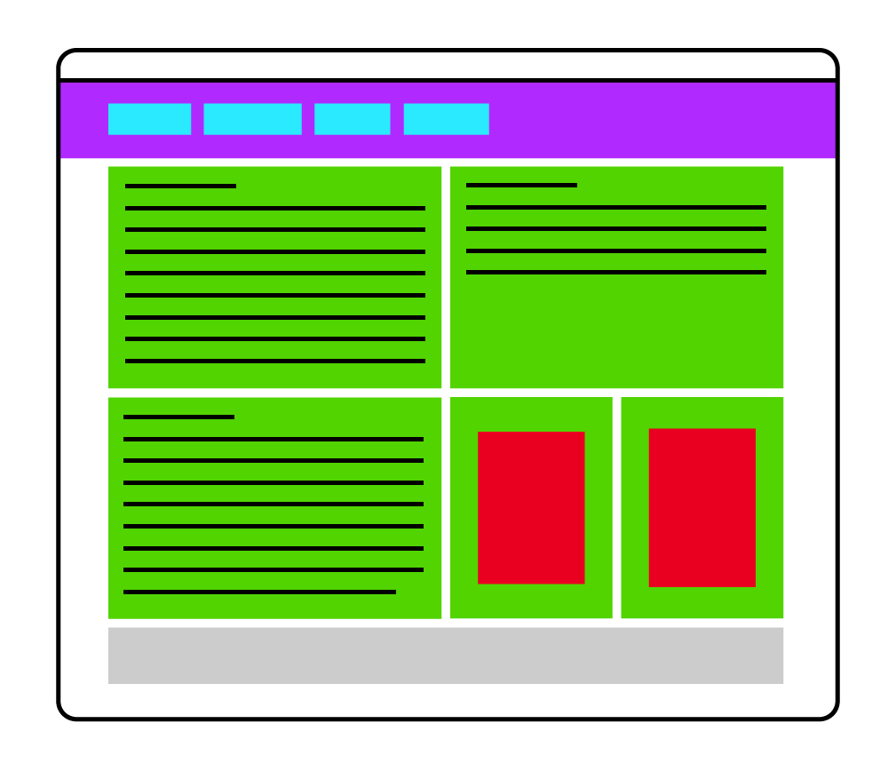

# CSS Layout

Practice layout and positioning with CSS

## Objectives

- Understand the box model
- Learn about css positioning
- Get to know flexbox

## Materials & Resources

| Material                                                                                                                               |    Time |
| :------------------------------------------------------------------------------------------------------------------------------------- | ------: |
| [Box-sizing article](https://css-tricks.com/box-sizing/)                                                                               | reading |
|                                                                                                                                        |         |
| **CSS positioning**                                                                                                                    |         |
| [1 - Positioning Introduction](https://www.youtube.com/watch?v=7ZXsPj43heo&index=1&list=PL4cUxeGkcC9hudKGi5o5UiWuTAGbxiLTh)            |    2:17 |
| [2 - Box Model Review](https://www.youtube.com/watch?v=d601NaSSqSE&list=PL4cUxeGkcC9hudKGi5o5UiWuTAGbxiLTh&index=2)                    |    5:57 |
| [3 - Normal Document Flow](https://www.youtube.com/watch?v=l8NH6YppJFA&list=PL4cUxeGkcC9hudKGi5o5UiWuTAGbxiLTh&index=3)                |    3:05 |
| [4 - Floating Elements](https://www.youtube.com/watch?v=VwxGKpvW8Zk&list=PL4cUxeGkcC9hudKGi5o5UiWuTAGbxiLTh&index=4)                   |   10:12 |
| [5 - Clearing Floats](https://www.youtube.com/watch?v=nE9lIRbIfI0&list=PL4cUxeGkcC9hudKGi5o5UiWuTAGbxiLTh&index=5)                     |    8:50 |
| [6 - Floating Columns](https://www.youtube.com/watch?v=bJJ7jgfSvZY&index=6&list=PL4cUxeGkcC9hudKGi5o5UiWuTAGbxiLTh)                    |    5:06 |
| [7 - Text Columns](https://www.youtube.com/watch?v=W77geg_3B5o&index=7&list=PL4cUxeGkcC9hudKGi5o5UiWuTAGbxiLTh)                        |    3:44 |
| [8 - Position Relative](https://www.youtube.com/watch?v=YBJqKWXL2vg&index=8&list=PL4cUxeGkcC9hudKGi5o5UiWuTAGbxiLTh)                   |    4:57 |
| [9 - Absolute Position](https://www.youtube.com/watch?v=2JMGG_8T-vY&list=PL4cUxeGkcC9hudKGi5o5UiWuTAGbxiLTh&index=9)                   |    5:21 |
| [10 - Fixed Position](https://www.youtube.com/watch?v=8fQWx-d5qc8&index=10&list=PL4cUxeGkcC9hudKGi5o5UiWuTAGbxiLTh)                    |    4:34 |
| [11 - Z - Index & Stacking Order](https://www.youtube.com/watch?v=k4taTzkhzHc&index=11&list=PL4cUxeGkcC9hudKGi5o5UiWuTAGbxiLTh)        |    8:31 |
| [12 - Clipping Content](https://www.youtube.com/watch?v=ED1mhlAVAGU&list=PL4cUxeGkcC9hudKGi5o5UiWuTAGbxiLTh&index=12)                  |    8:31 |
|                                                                                                                                        |         |
| **CSS flex-box**                                                                                                                       |         |
| [1 - Flex-Box Introduction](https://www.youtube.com/watch?v=Y8zMYaD1bz0&index=1&list=PL4cUxeGkcC9i3FXJSUfmsNOx8E7u6UuhG)               |    5:17 |
| [2 - Flex Containers](https://www.youtube.com/watch?v=ux4h6pejCSM&list=PL4cUxeGkcC9i3FXJSUfmsNOx8E7u6UuhG&index=2)                     |    6:26 |
| [3 - Flex Grow](https://www.youtube.com/watch?v=yPK8cwBEOmg&list=PL4cUxeGkcC9i3FXJSUfmsNOx8E7u6UuhG&index=3)                           |    4:58 |
| [4 - Flex Shrink](https://www.youtube.com/watch?v=tSdq8amjMso&index=4&list=PL4cUxeGkcC9i3FXJSUfmsNOx8E7u6UuhG)                         |    4:09 |
| [5 - Flex Wrap](https://www.youtube.com/watch?v=rlZ-fC5eWWk&index=5&list=PL4cUxeGkcC9i3FXJSUfmsNOx8E7u6UuhG)                           |    4:42 |
| [6 - Flex Basis](https://www.youtube.com/watch?v=j5RxNRFWMwo&index=6&list=PL4cUxeGkcC9i3FXJSUfmsNOx8E7u6UuhG)                          |    5:01 |
| [7 - Creating a Menu with Flexbox](https://www.youtube.com/watch?v=2plKBskaKfY&list=PL4cUxeGkcC9i3FXJSUfmsNOx8E7u6UuhG&index=7)        |    8:02 |
| [8 - Creating Nested Menu's with Flexbox](https://www.youtube.com/watch?v=8Ls7maJvjwQ&index=8&list=PL4cUxeGkcC9i3FXJSUfmsNOx8E7u6UuhG) |    8:09 |
| [9 - Axis](https://www.youtube.com/watch?v=8vcSr1yVvXQ&list=PL4cUxeGkcC9i3FXJSUfmsNOx8E7u6UuhG&index=9)                                |    6:43 |
| [10 - Align Items on the Cross Axis](https://www.youtube.com/watch?v=WY2itpeUK7Q&index=10&list=PL4cUxeGkcC9i3FXJSUfmsNOx8E7u6UuhG)     |    4:41 |
| [11 - Grid vs Stacked Layout Example](https://www.youtube.com/watch?v=B_E6Kh9YkFM&index=11&list=PL4cUxeGkcC9i3FXJSUfmsNOx8E7u6UuhG)    |    9:03 |
| [12 - Element Order](https://www.youtube.com/watch?v=FPl-7mTW20U&index=12&list=PL4cUxeGkcC9i3FXJSUfmsNOx8E7u6UuhG)                     |    4:26 |

### Optional

*If you've got time and/or want to dig deeper, consider the following:*

| Material                                                                                          |        Time |
| :------------------------------------------------------------------------------------------------ | ----------: |
| [All about floats](https://css-tricks.com/all-about-floats/)                                      |     reading |
| [CSS positioning 101](http://alistapart.com/article/css-positioning-101)                          |     reading |
| [CSS positioning screencast](http://www.barelyfitz.com/screencast/html-training/css/positioning/) | interactive |
| [Flexbox and Grids, your layout’s best friends](https://aerolab.co/blog/flexbox-grids/)           |     reading |

## Material Review

- box sizing
- display:
  - block
  - inline
  - inline-block
  - none
- float
  - clear
  - clearfix with pseudo elements
- position:
  - static
  - relative
  - absolute
  - fixed
- z-index
- flex-box
  - purpose
  - orientation
  - positioning
- overflow

## Workshop

Build these simple layouts in HTML and CSS

- Create each in its own, separate directory
- Try to use the most simple selector when selecting an element
- Try to avoid duplicating code
- Use paint, gimp, irfanview or something similar to figure out the sizes and
  colors

### Bookmarks

- <https://css-tricks.com/snippets/css/a-guide-to-flexbox/>
- <http://yoksel.github.io/flex-cheatsheet/>

### Flexbox

```CSS
.container {
  display: flex;
  align-items: center;
  justify-content: space-around;
}

.item {
  align-self: flex-end;
}
```

#### Exercise 1

Reproduce the following 4 layouts with the same HTML structure:

```HTML
<div class="container">
  <div class="item green"></div>
  <div class="item yellow"></div>
  <div class="item purple"></div>
</div>
```

##### Exercise 1.1


- the items should be fixed width and height

##### Exercise 1.2


- the items should fill all available horizontal space
- the yellow item should be twice as big as the side items

##### Exercise 1.3


- the items' order should stay the same in the HTML and only change in display

##### Exercise 1.4



- the container should have a fixed width
- the items should fill all available horizontal space
- the yellow item should be twice as tall as the side items

#### Exercise 2


- the items should have fixed sizes
- the purple item should be centered in the yellow area

#### Exercise 3

Reproduce the following 3 layouts with the same HTML structure:

```HTML
<ul class="container">
  <li class="item"></li>
  <li class="item"></li>
  <li class="item"></li>
  <li class="item"></li>
</ul>
```

- the purple items should have fixed size
- the yellow area should fill all available horizontal space
- the yellow area should have a fixed height

##### Exercise 3.1


##### Exercise 3.2



##### Exercise 3.3


### Layouts

#### Exercise 4



- The layout should be centered on the page.
- The layout should have fixed width.
- When picking the semantically correct element, consider the roles of the
  boxes:
  - Purple: Header
  - Cyan: Navigation links
  - Yellow: Main Content
  - Green: Sidebar (not main content)

##### Exercise 4.1



- The header should fill available horizontal space
- The header should *stay in view, on top, even after scrolling*
- When picking the semantically correct element, consider the roles of the
  boxes:
  - Purple: Header
  - Cyan: Navigation links
  - Yellow: Main Content
  - Green: Sidebar (not main content)
  - Gray: Footer

#### Exercise 5


- It should be centered on the page.
- It should have fixed width.
- When picking the semantically correct element, consider the roles of the
  boxes:
  - Aqua (light blue): Header
  - Orange: Left sidebar (not main content)
  - Red: Main Content
  - Black: Fixed content on the bottom right of the Main content
  - Purple: Right sidebar (not main content)
  - Blue: Footer

##### Exercise 5.1


- It should be wall to wall with fluid width.
- The sidebars should have fixed with.

#### Exercise 6



- The layout should have a fixed *maximum* width
- The green sidebar should have a fixed width
- The yellow main area should fill all available space
- There should be 4 of the red list item squares next to each other but their
  width can be flexible
- You can use any lorem ipsum generator for texts instead of the lines

#### Exercise 7



- The header should fill available horizontal space
- The header should *stay in view, on top, even after scrolling*
- The rest of the layout should have a fixed *maximum* width
- The green boxes should keep their relative size - 1:1, 2:1:1 per row
- You can use any lorem ipsum generator for texts instead of the lines

## Individual Workshop Review

Please follow the styleguide:
[Our HTML & CSS styleguide](../../styleguide/html-css.md)

- Did you create a separate directory for each exercise?
- How complex are your CSS selectors? Can you write a shorter one that still
  works?
- Are you sure you don't have unnecessary duplications in your code?
