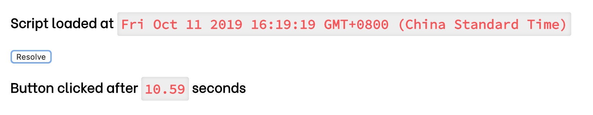
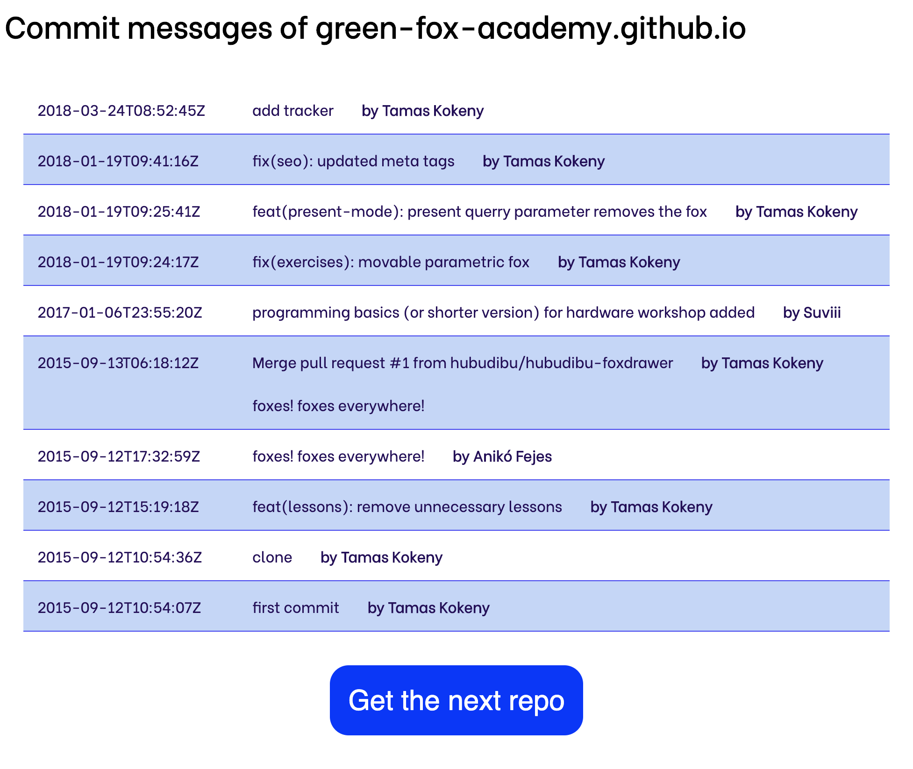
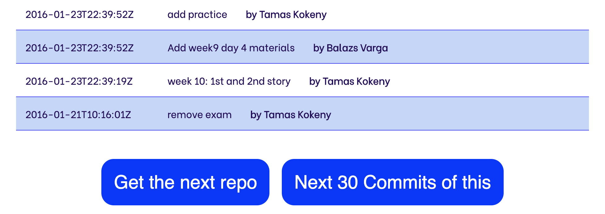

# `async` / `await` and generator functions

## Materials

Material | Time
-|-
[async / await in JavaScript](https://www.youtube.com/watch?v=568g8hxJJp4) | 23:59
[Generators in JavaScript](https://www.youtube.com/watch?v=ategZqxHkz4) | 27:19
[Async / await](https://javascript.info/async-await) | reading
[Generators](https://javascript.info/generators) | reading


## Material Review
- `async` function
- `await` statement
- generator function
- `yield` statement

## Workshop

### What's the time?

Create a small web application which tells the user how many seconds have passed between loading the site and pressing the `Resolve` button.



- Solve the exercise with simple event listener and callback
- Now solve it again by creating and initializing a `Promise` and using `then`
  - The function that creates the `Promise` should have the button as a parameter
  - The `resolve` should be called with the seconds passed
- Third times a charm, skip the `then` with an `async` method using `await`

### Stop me if you can

Create a small web application which `alert`s this text: `5 seconds passed!` after 5 seconds of loading the page.
The page when loaded should only contain a `CANCEL` button which by pressing it cancels the alert.
- Solve the exercise with simple callbacks
- Solve it again with a `Promise` using both the `resolve` and `reject`
- On third time use `async` / `await` again

### Pour me another

Create a hipster name generator using a generator function.
- On the html page you should have at least a header element and a button
- When clicking on the button a name from the list above should be revealed in the header element

```javascript
const names = ['Esther','Eulalia','Harriet','Ida','Lula','Marguerite','Mary','Minerva','Nancy','Pearl','Rowena','Theodosia','Zephyrine','Albert','Bernard','Chester','Edmund','Ira','Leon','Linus','Ralph','Roger','Stanley','Van','Victor','Virgil','Wilfred','Esmeralda','Fernanda','Flavia','Ines','Io','Ione','Ludovica','Olga','Noa','Fflur','Saskia','Soleil','Anders','Bas','Boris','Dev','Dimitri','Ivan','Lazaro','Magnus','Neo','Seb','Soren','Vladimir','Teilo','Andromeda','Aster','Azalea','Bee','Birdie','Blossom','December','Dove','Lilac','Maple','Nova','Vega','Ash','Beach','Bear','Frost','Hawk','Huckleberry','Mars','Oak','Pike','Agatha','Agnes','Constance','Ethel','Eunice','Francine','Gertrude','Ida','Lenore','Mildred','Myrtle','Opal','Thomasina','Wilhelmina','Clarence','Edgar','Floyd','Irving','Leonard','Murray','Osbert','Oswald','Percival','Sheldon'];
```

### Joke Extension

Replace your callbacks on `Promise`-s with `await`-s in the [`fetch` some joke exercise](../promise-and-fetch/fetch-some-joke/README.md)

### Simplify

Simplify the `promiseHell()` with `async` / `await`

```javascript
const myGetHttp = (url) => {
  return new Promise((resolve, reject) => {
    resolve(`This is a dummy HTTP response for GET ${url}`);
  });
};

const myParser = (string) => {
  return new Promise((resolve, reject) => {
    resolve(`This is the parsed response: ${string}`);
  }); 
}

const myDbSaver = (dataToSave) => {
  return new Promise((resolve, reject) => {
    resolve(`This data is saved: ${dataToSave}`);
  });
}

const notifyUser = (message) => {
  return new Promise((resolve, reject) => {
    resolve(`User is notified about this: ${message}`);
  });
}

function promiseHell() {
  myGetHttp('http://api.something.com/do').then((response) => {
    console.log('Got HTTP response');
    myParser(response).then((parsed) => {
      console.log('Got parsed HTTP response');
      myDbSaver(parsed).then((message) => {
        console.log('Response is saved in the DB');
        notifyUser(message).then((result) => {
          console.log(result);
        }).catch((error) => {
          console.log('Something bad happened', error);
        });
      }).catch((error) => {
        console.log('Something bad happened', error);
      });
    }).catch((error) => {
      console.log('Something bad happened', error);
    });
  }).catch((error) => {
    console.log('Something bad happened', error);
  });
}

callbackHell();
```

### Github Commits

Create a simple web application, where you can list the latest commits from one of the repositories `green-fox-academy`.



The application should start with an empty page where only the title and the button is visible:


When the user clicks the button the app should load the first repository:
- the Title should change to the repository name
- the latest commit messages should be displayed of the repository
  - optionally the date of the creation and the author of the commit can be displayed

When the user clicks on the button again, the app loads the next repository.

#### API urls

`GET https://api.github.com/orgs/green-fox-academy/repos`
- is going to list all the repositories under `green-fox-academy` organization
- check out the exact JSON structure of the response

`GET https://api.github.com/repos/green-fox-academy/{repo}/commits`
- is going to list the latest commits in the `{repo}` repository
- check out the exact JSON structure of the response

[More on the official Github API documentation](https://developer.github.com/v3)

#### Structure

- Use a generator function for yielding the repositories one by one from the response of the first url
- When the user clicks on the button just call the iterator's next function
- Use async and await when fetching the data

#### Optional

Create another button for the Github Commits app that can list the next 30 commits of the same repository.

- The button should only show if there're 30 commits displayed (so there can be more and not on the empty first page)
- When the user clicks on the button the app should load the previous 30 commits
- And display them below the commits already there
- If the newly added commit list's length is also 30, then the button should stay visible
- If not, the button should be hidden
- Use another generator function for retrieving the commits, so you can call the next function when the user clicks this new button
- Check out the [API docs on Github](https://developer.github.com/v3/repos/commits/#list-commits-on-a-repository)



#### Hint

You're only allowed to request from the Github API 60 times / hour without authentication.

If this happens you can easily create an authenticated API request:

- [Generate a personal token here](https://github.com/settings/tokens/new)
  - make sure to select the `public_repos` scope
- update your `fetch`-es with `Basic` authentication `header`:

```javascript
let headers = new Headers()
headers.set('Authorization', 'Basic ' + btoa('yourgithubusername' + ":" + 'yourpersonaltoken'));

fetch('https://api.github.com/orgs/green-fox-academy/repos', {headers})
    
```
