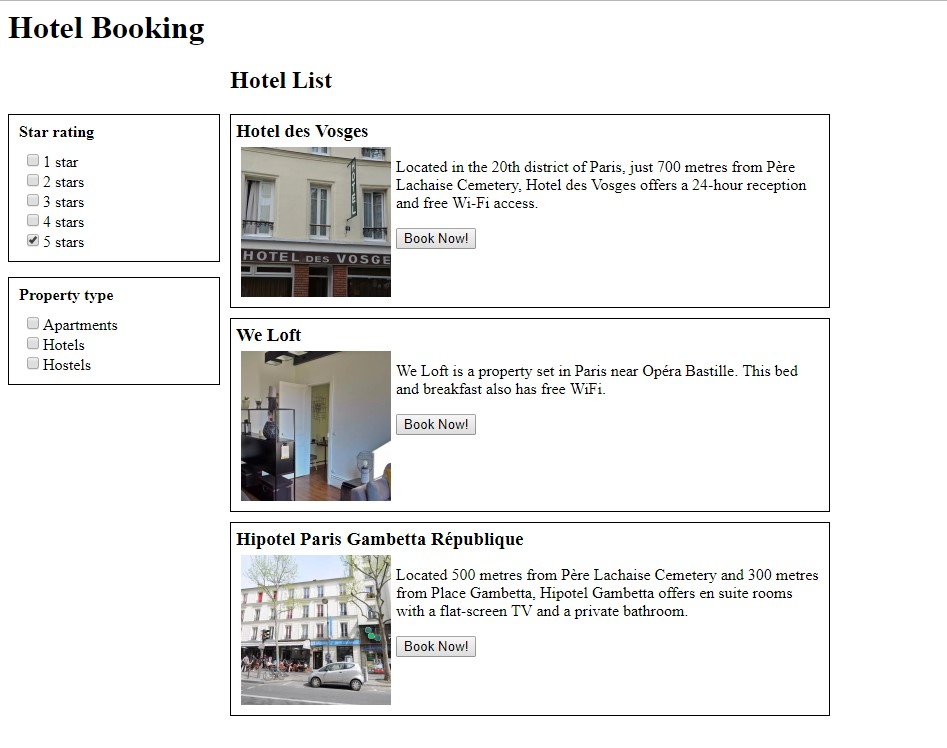

# Introduction to React

## Materials and Resources

| Material | Time |
|:---------|-----:|
| [Getting started with React](https://www.youtube.com/watch?v=7uf3SCgduPg) | 10:43 |
| [Minimal React setup](https://www.robinwieruch.de/minimal-react-webpack-babel-setup/) | 5 min read |
| [Create React app](https://github.com/facebook/create-react-app) | a lot of read |

## Material Review

- What's webpack and how is it useful?
- What's a component in React and what problem does it solve?
  - What's an element?
- What's JSX?
- What are properties?
- What's the easiest way to start a new project with React?

## Workshop

### Project setup without `create-react-app`

Create a new folder for your project, and create two folders with the names `src` and `dist` respectively. Create `index.html` under the `dist` folder with the following contents:

```html
<html>
  <head></head>
  <body>
    Hello from webpack
    <script src="bundle.js"></script>
  </body>
</html>
```

The referenced `bundle.js` file is generated by webpack.

#### Webpack setup

```bash
npm init -y
npm install --save-dev webpack webpack-dev-server webpack-cli
```

Create a new file named `webpack.config.js` with the following contents:

```javascript
module.exports = {
  entry: './src/index.js',
  output: {
    path: __dirname + '/dist',
    publicPath: '/',
    filename: 'bundle.js'
  },
  devServer: {
    contentBase: './dist'
  }
};
```

The `src` folder is the main directory for the source files.

Create a new file called `index.js` with the following contents:

```javascript
alert('hi');
```

At this point you can try to run webpack with the following command:

```bash
npx webpack
```

The command generates a packed version of the source code, and you can check it out in the `dist` folder.

You can now try to use the webpack development server to start up the application:

```
npx webpack-dev-server
```

This actually does a lot of things for you, most notably starts up an HTTP server which listens on `http://localhost:8080`. The dev server also watches the file system for changes. Try to change the `index.js` file and see what happens.

#### Babel with React setup

Stop the webpack dev server for now.

```bash
# install React
npm install --save react react-dom

# install Babel with the React preset
npm install --save-dev @babel/core babel-loader @babel/preset-react
```

Extend the webpack configuration file with the required configuration for Babel:

```javascript
module.exports = {
  entry: './src/index.js',
  module: {
    rules: [
      {
        test: /\.(js|jsx)$/,
        exclude: /node_modules/,
        use: ['babel-loader']
      }
    ]
  },
  resolve: {
    extensions: ['*', '.js', '.jsx']
  },
  output: {
    path: __dirname + '/dist',
    publicPath: '/',
    filename: 'bundle.js'
  },
  devServer: {
    contentBase: './dist'
  }
};
```

Also, create the configuration file for Babel called `.babelrc`:

```json
{
  "presets": [
    "@babel/preset-react"
  ]
}
```

Start the webpack dev server again and let's try to create our very first React application which utilizes **JSX**. Change the contents of the `src/index.js` file to the following:

```jsx
import React from 'react';

let element = <p>Hello React!</p>;
// OR without JSX:
//   let element = React.createElement('p', {}, 'Hello React!')

alert(element.props.children);
```

#### Introduce ReactDOM

So far we created a React element, let's use ReactDOM to project this element to the DOM. But first we need a container element in `index.html` :

```html
<html>
  <head></head>
  <body>
    <div class="react-container"></div>
    <script src="bundle.js"></script>
  </body>
</html>
```

Now we can target it and render our element.

```jsx
import React from 'react';
import ReactDOM from 'react-dom'

let element = <p>Hello React!</p>;

ReactDOM.render(element, document.getElementById('react-container'));
```

### First component

So far we've only created an element from the built-in `<p>` tag, and it's time to create our own:

Create a file called `first-component.js` under `src`:

```jsx
import React from 'react'

export default function FirstComponent() {
  return <p>Hello from the first component!</p>;
}
```

And use the component in the `index.js` file directly:

```jsx
import React from 'react'
import ReactDOM from 'react-dom'

import FirstComponent from './first-component'

let element = <FirstComponent />;

ReactDOM.render(element, document.getElementById('react-container'));
```

With JSX you can create elements from your own components as well.

### Introduction to properties

Every component may have input parameters which are called properties:

Create a file called `second-component.js` under `src`:

```jsx
import React from 'react'

export default function SecondComponent(props) {
  return <h1>{props.title}</h1>;
}
```

To pass parameters just change the code in the `index.js` file:

```jsx
let element = <SecondComponent title="My nice title" />;
```

Remember that JXS is just JavaScript at the end of the day so you can put any code inside the curly brackets `{ code }`.

For example to display a list of items you can use the the `.map()` function of the JavaScript `Array`:

```jsx
import React from 'react'

export default function SecondComponent(props) {
  return (
    <ul>
      {props.items.map(item => <li>{item}</li>)}
     </ul>
  );
}
```

And provide the input properties through the parent component:

```jsx
let element = <SecondComponent items={[ 'a', 'b', 'c' ]} />;
```

### Create your first component hierarchy

Your task now is to create a hierarchy of components. Here is the layout to create:



First of all, think through what components are needed to achieve the required layout.

After that, create the Components and bind the layout together. The application is read-only for now, and use the following data structure:

```javascript
let data = {
  filters: {
    'Star rating': [
      { name: '1 star', checked: false },
      { name: '2 stars', checked: false },
      { name: '3 stars', checked: false },
      { name: '4 stars', checked: false },
      { name: '5 stars', checked: true }
    ],
    'Property type': [
      { name: 'Apartments', checked: false },
      { name: 'Hotels', checked: false },
      { name: 'Hostels', checked: false }
    ]
  },
  hotels: [
    {
      name: 'Hotel des Vosges',
      description: 'Located in the 20th district of Paris, just 700 metres from Père Lachaise Cemetery, Hotel des Vosges offers a 24-hour reception and free Wi-Fi access.',
      imageURL: 'https://s-ec.bstatic.com/xdata/images/hotel/square600/13072445.webp?k=9c12bda1f8c02f76fa0ea4a6ea00e6f7074753025bc0c187f7b6fc3076343401&o='
    },
    {
      name: 'We Loft',
      description: 'We Loft is a property set in Paris near Opéra Bastille. This bed and breakfast also has free WiFi.',
      imageURL: 'https://t-ec.bstatic.com/xdata/images/hotel/square600/96299078.webp?k=1ab1cd2966b00e21df37c28b1fed925f86da5a8834bacf06509397d26ffa8f26&o='
    },
    {
      name: 'Hipotel Paris Gambetta République',
      description: 'Located 500 metres from Père Lachaise Cemetery and 300 metres from Place Gambetta, Hipotel Gambetta offers en suite rooms with a flat-screen TV and a private bathroom.',
      imageURL: 'https://t-ec.bstatic.com/xdata/images/hotel/square600/45324268.webp?k=deb5c9732389dbe8e7411602b3b83cbb32d4c57b8c7842621d7d085fb2a4c9db&o='
    }
  ]
};
```

Use minimal CSS for now.

### Project setup with `create-react-app`

This is a lot of configuration and it's very tedious; therefore, the React team created a set of scripts for you to get started faster.

Create **a new folder outside of the previous one** and let's install just the `create-react-app` script which in fact will handle everything else:

```bash
npx create-react-app my-app
```

You don't need to configure anything, Babel, Webpack, React, JSX is configured for you. A reasonably good configuration of both development and production builds is handled for you so you can focus on writing code.

You can start developing using the following command:

```bash
cd my-app
npm start
```

Now check out the project setup, check every file and folder to see the code generated for you.

From now on we're going to use `create-react-app` for every exercise.
