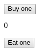

# SimpleGoldenAcornApp

## Preview



## Functionality

```gherkin
Scenario: using the SimpleGoldenAcornApp with buttons
  Given I have 0 🌰
  When I click on the 'Buy one' button
  Then the amount of 🌰 increases by one

  Given I have 1 🌰
  When I click on the 'Eat one' button
  Then the amount of 🌰 decreases by one

  Given I have 0 🌰
  When I click on the 'Eat one' button
  Then the amount of 🌰 does not change

Scenario: using the SimpleGoldenAcornApp with arrow keys
  Given I have 0 🌰
  When I press the 'Up Arrow' key
  Then the amount of 🌰 increases by one

  Given I have 1 🌰
  When I press the 'Down Arrow' key
  Then the amount of 🌰 decreases by one

  Given I have 0 🌰
  When I press the 'Down Arrow' key
  Then the amount of 🌰 does not change
```

## Guidance

- create a class *-stateful-* component
  - **SimpleGoldenAcornApp** should store a number in the states and
    contain the business logic
  - it should have an **handleIncrement** and **handleDecrease** function which update the state

## Optional

- At the main **SimpleGoldenAcornApp** component try to update the state with arrow keys
- separate into two functional *-stateless-* components &mdash;
  *[functional components](https://reactjs.org/docs/components-and-props.html#functional-and-class-components)*
  - **Button** should get a function and a string via properties
  - **Display** should get a number via the special `children` property
    &mdash; *[containment](https://reactjs.org/docs/composition-vs-inheritance.html#containment)*
- add [`prop-types`](https://www.npmjs.com/package/prop-types) to the dependencies
- check the properties with `prop-types`
