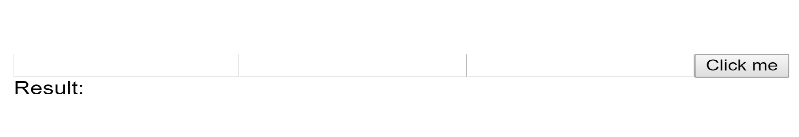

# Calculator

Create a simple calculator with states.

## Preview



## Functionality

```gherkin
Scenario 1:
  Given the loaded page
  When the first and the last input fields are filled with numbers
  And the input field in the middle filled with a good operator(+, -, /, *)
  And i click on the button
  Then the result is calculated

Scenario 2:
  Given the loaded page
  When i leave an input field blank
  Then the button is disabled

Scenario 3:
  Given the loaded page
  When the first and the last input fields are filled with string
  And the input field in the middle filled with a good operator(+, -, /, *)
  And i click on the button
  Then the result is: "The first and the last input field should be a number"

Scenario 4:
  Given the loaded page
  When the first and the last input fields are filled with number
  And the input field in the middle filled with a wrong input (', =, g, 1, etc.)
  And i click on the button
  Then the result is: "Please choose a good operator: (+, -, /, *)"
```

## Guidance

- create a class *-stateful-* component
- **Calculator** class should store the result, the numbers, and the operator in the states and
    contain the business logic
- it should have **only one** handleChange method, where you handle the input changes
- implement the following calculations:
  - summation (+)
  - subtraction (-)
  - multiplication (*)
  - division (/)
- use some error handling:
  - input is not a number
  - wrong operator
  - one of the input is blank
