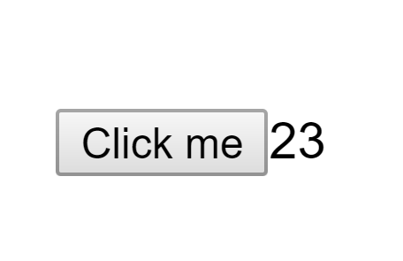

# Interval

Create a simple timer application.

## Preview



## Functionality

```gherkin
Scenario 1:
  Given the page
  When its loaded
  Then the timer should be start counting in every second

Scenario 2:
  Given the loaded page
  When i click on the button
  Then the timer should be two times faster
```

## Guidance

- create a class *-stateful-* component
- **Interval** class should store the timer in the states and
    contain the business logic
- you should create an interval which is increase the timer in every second when the page is loaded *hint: use setInterval*
- if you click on the button the timer should be two times faster
- *hint: you should use component lifecycle methods*
