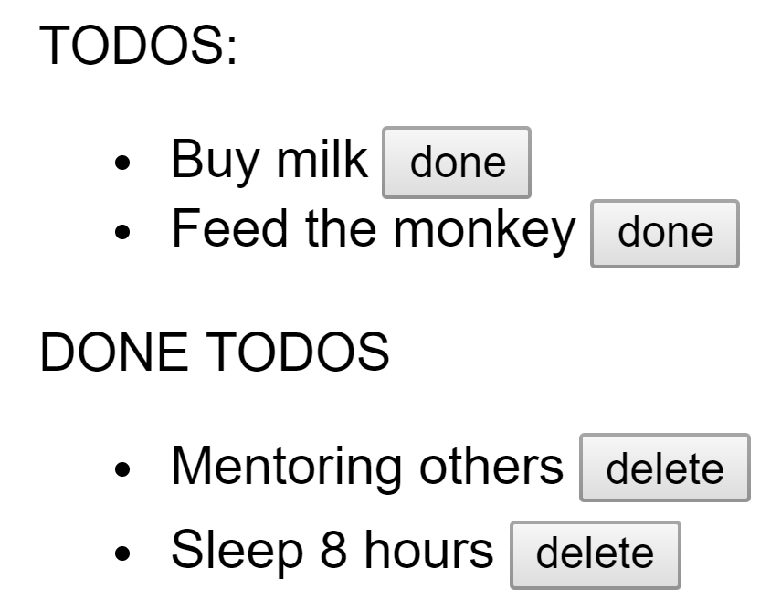

# Todo app

## Preview



## Functionality

```gherkin
Scenario 1:
  Given the page
  When its loaded
  Then the todos rendered by priority

Scenario 2: 
  Given the loaded page
  When i click on the done button
  Then its added to my done todos

Scenario 3: 
  Given the loaded page
  When i click on the remove button
  Then its removed from the done todos
```

## Mock data

*Use this state for the project.*

```javascript
  state = {
    todo: [
      {
        text: 'Feed the monkey',
        prio: 2
      },
      {
        text: 'Buy milk',
        prio: 1
      }
    ],
    doneTodo: [
      {
        text: 'Sleep 8 hours',
        prio: 2
      },
      {
        text: 'Mentoring others',
        prio: 1
      }
    ],
  }
```
## Guidance

- create a class *-stateful-* component
  - **TodoApp** should store a todos and done todos in the states in arrays and
    contain the business logic
  - the component should render all the todos and done todos by priority (1 is the most priority)
  - it should have a *doneTodo* method where you should check a todo and add it to the done todolist
  - it should have a *deleteTodo* method where you should delete done todos from the done todo list

## Optional
- separate into two functional *-stateless-* components 
  - **DoneTodo** should get a function and a string via properties
  - **Todo** should get a function and a string via properties
  - **TodoApp** component should render multiple **ToDo** and **DoneTodo** component
- add [`prop-types`](https://www.npmjs.com/package/prop-types) to the dependencies
- check the properties with `prop-types`
