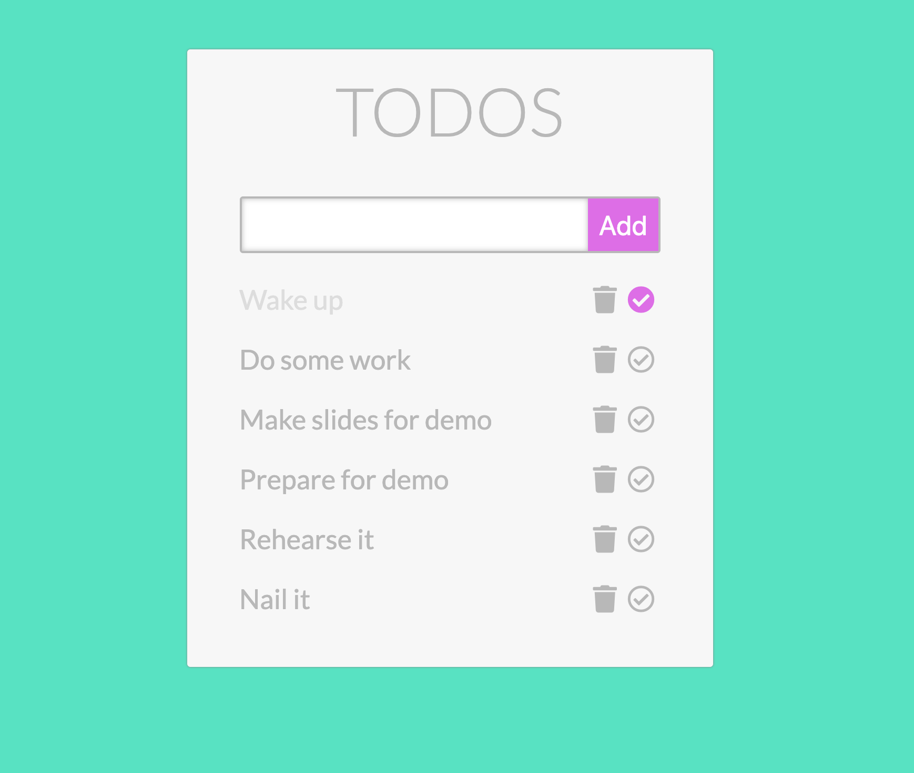
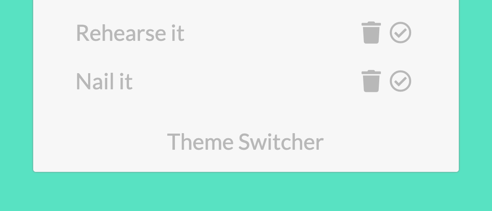
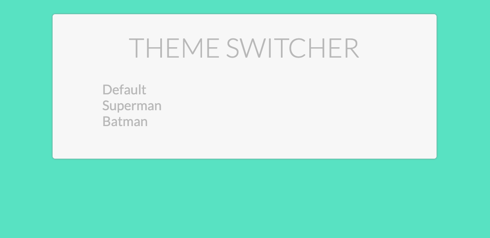
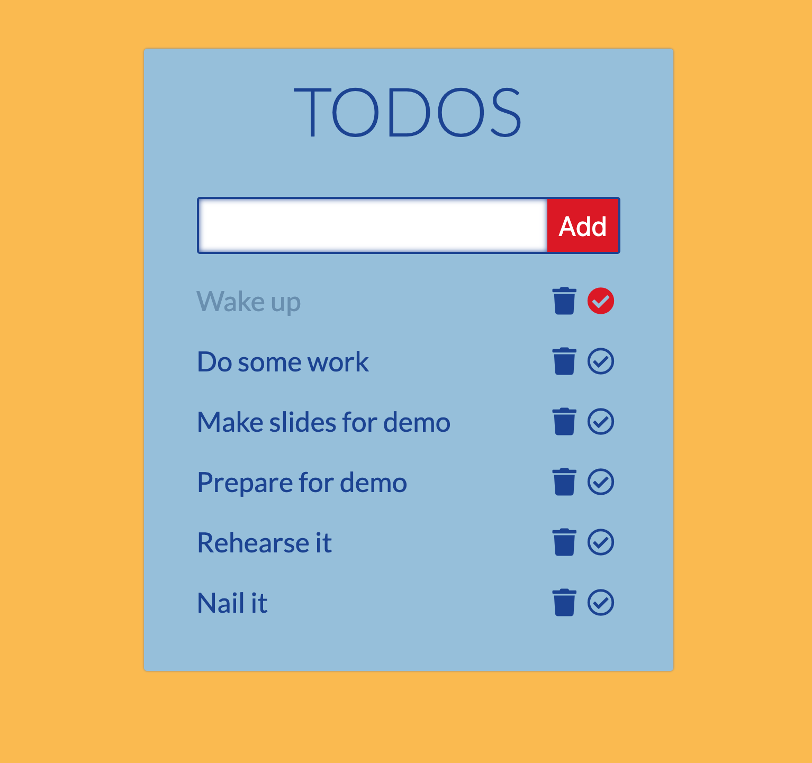
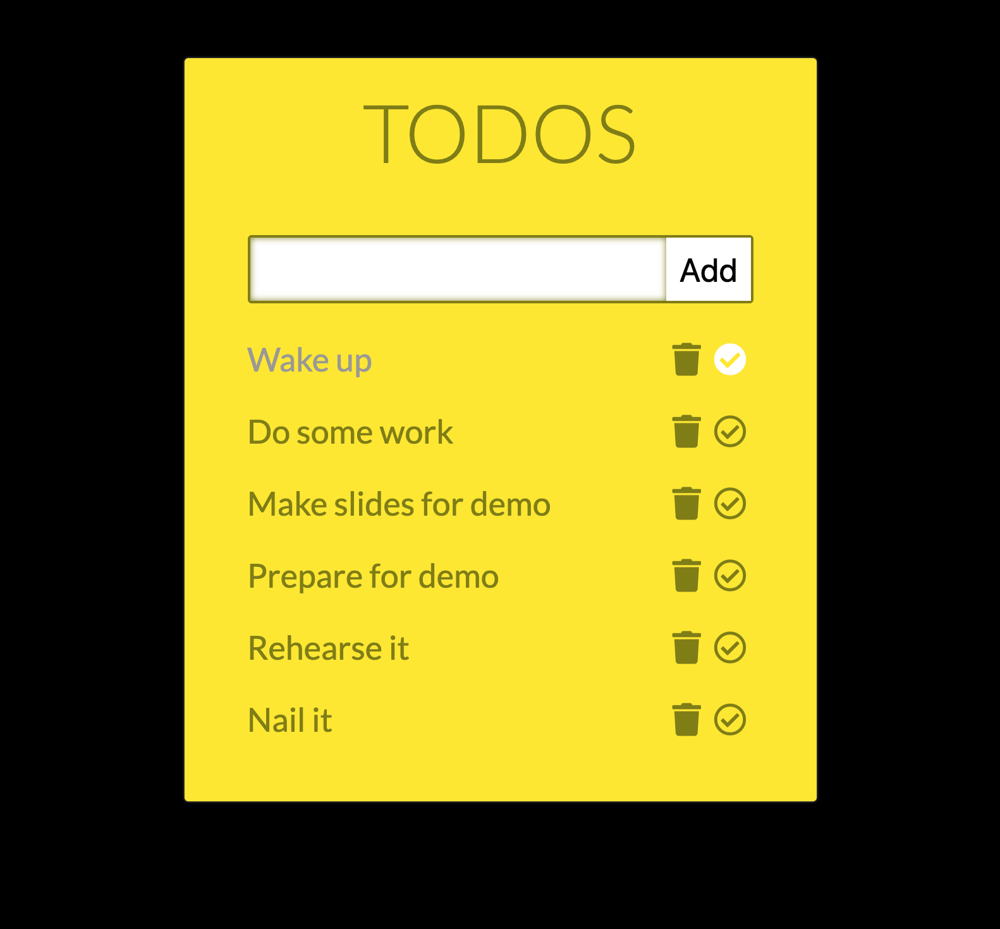
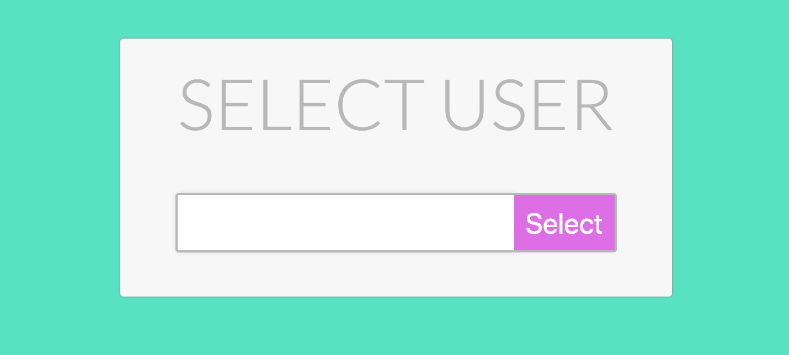

# App frontend



## Give the above design, create the UI

- HTML
- CSS
- Find cool icons at: http://iconfinder.com/ - prefer SVG-s since they are
  resolution independent
- Or use https://fontawesome.com

### Text styles

```css
.heading {
  font-family: 'Lato', sans-serif;
  font-size: 64px;
  font-weight: 300;
  color: #b8b8b8;
}

.todo-item {
  font-family: 'Lato', sans-serif;
  font-size: 26px;
  line-height: 2.2;
  color: #b8b8b8;
}

.button-text {
  font-family: 'Lato', sans-serif;
  font-size: 26px;
  color: #ffffff;
}
```

## The root `/` route

- on page load, the user should not have any todos
- when adding a new todo:
  - the todo's title needs to be at least 3 character
  long, otherwise the app should display an error (you decide how)
- when deleting a todo:
  - remove the todo item for the UI
- when completing a todo:
  - update the todo item's checkmark icon

You don't have to use database or any kind of persistent data, just store all user data in the app's states.

## The `/themes` route



Add a new link to the bottom of the app called Theme Swither, which should direct the user to the Theme Switcher Component:



When selecting a theme the app should direct the user back to todos and change it's displaying colors using URL parameters:

- `/themed/superman` or `/themed/batman`
- If the user modifies the URL parameter to not existing theme:
  - the todos should be displayed in the default theme
  - and an error message that the `Theme was not found`
- Hint: use CSS in JS





## Multiple users

Create a User selector component, where the user can enter it's username. This component should load on the `/` route from now on:



When clicking on Select:
  - if there's no username entered, display an error
  - otherwise display the todos for the entered username (empty list if it's a new one) on the route:

`/user/:username`

Add a User Switcher link to bottom of the todos, so the user can navigate back and change the username.

## Optional

- Create an Edit Component and add an Edit button to the todos
- Add multiple fields to the Todo to be edited like:
  - description
  - deadline
