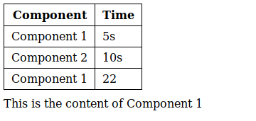

# Hooks & Lifecycle methods

## Objectives

- Get familiar with component lifecycle
- Learn how to use states in function components
- Learn how to replace lifecycle methods with hooks

## Materials & Resources

| Material                                                                                            |  Time |
| :-------------------------------------------------------------------------------------------------- | ----: |
| [React Lifecycle Methods - React for beginners #5](https://www.youtube.com/watch?v=0NbHbRdmGrs)     | 25:41 |
| [React Hooks - useState (get started)](https://www.youtube.com/watch?v=-G43PbpmGrA)                 | 16:51 |
| [React Hooks - useEffect](https://www.youtube.com/watch?v=sjCe4iHyxxs)                              | 15:31 |
| [Fetching Data from an API with React Hooks useEffect](https://www.youtube.com/watch?v=k0WnY0Hqe5c) | 07:44 |
| [useEffect react hook tutorial](https://www.youtube.com/watch?v=-4ni4uCUcvY)                        | 15:19 |

## Material Review

### Lifecycle methods

- What are lifecycle methods?
  <!--
    Methods which get called upon different events in the lifetime of a
    component. A component gets rendered, mounted, updated and finally unmounted
    during its lifetime and you can add additional behaviours to these events
    with the help of lifecycle methods.
  -->
- When does the `componentDidMount` get invoked?
  <!--
    A component will be mounted to the DOM after it has been rendered, this
    method will be called after this mounting has happened.
  -->
- What is the difference between the `componentDidMount` and `componentDidUpdate`
  lifecycle method?
  <!--
    componentDidMount is called only once, when it is attached to the DOM while
    componentDidUpdate is called every time when the component receives new
    props or changes its state.
  -->
- What can be a common use case of the `componentDidMount` lifecycle method?
  <!--
    componentDidMount is a perfect place to send http requests or do some
    complex action so it won't delay the rendering and the component can be
    displayed as quickly as possible.
    Usually we render a loader first and then we can execute the complex
    functions.
  -->
- What can you do in the `shouldComponentUpdate` lifecycle method?
  <!--
    With shouldComponentUpdate method you can avoid the re-rendering of a
    component if the props change doesn't require that.
  -->

### Hooks

- Whats is the purpose of hooks?
  <!--
    With hooks we get many new benefits, like
      - adding features to functional components which were available only in
        class components
      - reduce code length
      - remove duplication by extract common code into hooks
  -->
- Why is it better to use functional components?
  <!--
    React in general tries to be a functional library and encourages the
    developers to write functional code, so its hooks fit into this thinking.
    One of the main point of functional programming is to get rid of state which
    prevents many common bugs and makes your code easier to debug.
  -->
- How can you add state management to a functional component?
  <!--
    With the useState hook
  -->
- How can you react to lifecycle events in a function component?
  <!--
    With the useEffect hook and its parameters
  -->
- Do we have only the `useState` and `useEffect` hooks?
  <!--
    Nope, there are many different predefined hooks in React.
    Also you can find Hooks written by other developers, for Authentication
    Form management, etc...
  -->
- Can I define custom hooks?
  <!--
    Yes, it is possible to define custom hooks based on your project and coding
    style. Hooks are relatively new tools than a strict API provided by the
    library.
  -->

## Workshop

### Lifecycle

#### Usage tracker

- Create a react application which displays
  - A table - where you can track the usage of components
  - A component
- Create two components which can be mounted to the root (App) component
- Change the currently mounted component by changing the url in the address bar
- Both components should track how long was it mounted to the root
- Each time when the content changes you should add a new line to the table with
  the components identifier and the time while the component was mounted

##### Example

#### Basic news application

- Checkout the [newsapi](https://newsapi.org/) and [slowwly](http://slowwly.robertomurray.co.uk/)
- Create a react application and a component which will be rendered to the App
- The rendered component should display the news from China after 3 seconds -
  the delay must be achieved with the slowwly tool, not with a timeout
  - It is enough if you simply list the title of the articles.
- During the delay a fancy loader should be displayed to get the user know that
  we are working on they request. You can pick a loader from <https://loading.io/css/>

#### Better news App

- You can remove the delay from the API request
- Extend the previous exercise's root element with an input
- The user should be able to provide specific country codes into this input
- If the country has changed please update the components content with the
  corresponding news

### Hooks

#### Better news App 2

- Rewrite the previous exercise with functional components and hooks
