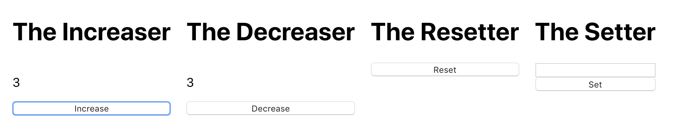
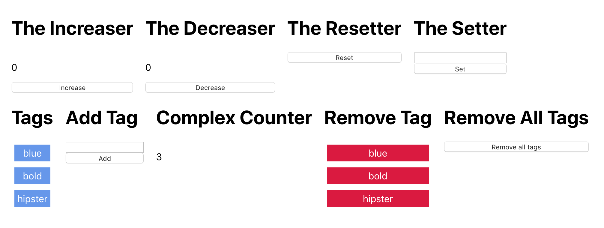

# Redux

## Materials & Resources

| Material | Time |
|:-------- | ----:|
|[Introduction to Redux](https://www.youtube.com/watch?v=HKU24nY8Hsc)| 5:56 |
|[Redux stores](https://youtu.be/sNyXE35liAE)| 5:15 |
|[Redux actions](https://youtu.be/FGCsuwIORb0)| 4:15 |
|[Redux reducers](https://youtu.be/w3okdbomqxo)| 3:06 |
|[Store Subscriptions](https://youtu.be/0r3eKhWag-8)| 5:49 |
|[Setting up Redux in React](https://youtu.be/f87wPQMgF4c)| 6:19 |
|[Map State to Props](https://youtu.be/CZ2qGtAnhoE)| 6:45 |
|[Example: blog detail page](https://youtu.be/SoOTQW4-tYk)| 6:14 |
|[Map Dispatch to Props](https://youtu.be/40pWMVMnftc)| 11:04 |
|[Action creators](https://youtu.be/sY1mPVaUYds)| 3:55 |
|[Redux Dev Tools](https://www.youtube.com/watch?v=Jy-xXB8O12I)| 5:58 |
|[Components & Containers](https://youtu.be/m2q3Dyr6To4)| 3:54 |
|[Better project Structure](https://youtu.be/YmGm-qwbJdc)| 10:57 |

### Optional

| Material | Time |
|:-------- | ----:|
|[What is redux?](http://www.gistia.com/beginners-guide-redux/)| - |
|[Redux example](https://medium.freecodecamp.org/how-to-use-redux-in-reactjs-with-real-life-examples-687ab4441b85)| - |

## Material Review

### Redux

- What is the purpose of Redux?
- What is the principles of Redux?
- What is the store means?
- What is an action means?
- What is an action creator?
- What is dispatching?
- What is a reducer?
- How can you combine multiple reducers?
- What is the data-flow at Redux? 
- What's the difference between Context and Redux (When to use what)?
- What's the difference between a component and a container?

## Workshop

### Plain Redux

Create a store, a reducer and actions in just plain JavaScript. (You can use a React Project created by `create-react-app` or just a plain node project, just don't forget to `npm install redux`)

#### Initial state
```
{
  counter: 0,
  tags: []
}
```

#### Actions & Reducers

Create the following counter related actions and create a reducer for them:
- Increase the counter by `1`
- Decrease the counter by `1`
- Increase the counter by `amount` payload
- Decrease the counter by `amount` payload
- Reset the counter to `0`
- Set the counter to `amount` payload

Try them out:

```javascript
store.dispatch({type: 'SET', amount: 6});
store.dispatch({type: 'INCREASE'});
store.dispatch({type: 'INCREASE', amount: 2});
store.dispatch({type: 'RESET'});
store.dispatch({type: 'INCREASE'});
store.dispatch({type: 'DECREASE', amount: 4});
// This should change the counter's value: 6, 7, 9, 0, 1, -3
```

Create the following tag related actions and create a reducer for them:
- Add a `tag`
- Remove a `tag`
- Remove all `tag`s

A tag is simple string, but it is unique list, so if a tag is already present in the list don't add it again.

Try them out:

```javascript
store.dispatch({type: 'ADD_TAG', tag: 'blue'});
store.dispatch({type: 'ADD_TAG', tag: 'bold'});
store.dispatch({type: 'ADD_TAG', tag: 'hipster'});
store.dispatch({type: 'REMOVE_TAG', tag: 'blue'});
store.dispatch({type: 'ADD_TAG', tag: 'bold'});
store.dispatch({type: 'REMOVE_TAGS'});
// This should change the tag list's value: ['blue'], ['blue', 'bold'], ['blue', 'bold', 'hipster']
// ['bold', 'hipster'], ['bold', 'hipster'], []
```

### Redux Components

Add the created store, actions and reducers to a React project and configure it to `Provide` the store to the `App` component (don't forget to `npm install react-redux`).

Create the following components separately and add them to the `App`:

#### The Increaser


- It has a title
- A text displaying the current value of the `counter` of the redux store
- When clicking on the button the component should `dispatch` an increase by 1 action
- Map the state and dispatch to the component's props

#### The Decreaser


- It has a title
- A text displaying the current value of the `counter` of the redux store
- When clicking on the button the component should `dispatch` an decrease by 1 action
- Map the state and dispatch to the component's props


#### The Resetter


- It has a title
- When clicking on the button the component should `dispatch` a reset counter action
- Map the dispatch to the component's props


#### The Setter


- It has a title
- An input to set the new value of counter to
- When clicking on the button the component should `dispatch` an set action with a payload of the input's current value
- Map the dispatch to the component's props

Now you should have something like this:



#### The Tag List


- Set your initial state to blue, bold and hipster to have something to display
- The tags are displayed as separate elements

#### Add Tag


- It adds the tag from the input to the store when clicking on the button

#### Remove Tag


- When clicking on a tag, it removes the tag from the store

#### Complex Counter


- It displays a number, which is the sum of the state's `counter` plus the length of `tags` list
- eg. when the counter is at 3 and you have 2 tags, it should display 5
- The number is updated when any of those changes (by any other component)

#### Remove All Tags


- Clicking on the button, it removes all tags from the store

Now you should have something like this:



### Optional

- Try out the [Redux Devtools](https://chrome.google.com/webstore/detail/redux-devtools/lmhkpmbekcpmknklioeibfkpmmfibljd?hl=en) Chrome Extension
- Create in Increase by input value Component
- Create in Decrease by input value Component
- Create an Add multiple tags Component (where you can have a separator for the tags eg. `,`)
- Implement a Redux Store for your Todo App
- Implement a Redux Store for your Gallery App
