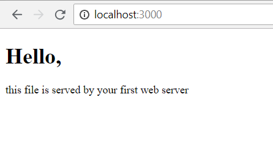

# Server side basics

## Materials & Resources

| Material                                                                 | Time |
|:-------------------------------------------------------------------------|-----:|
| [Clients & Servers](https://www.youtube.com/watch?v=qSAze9b0wrY)         | 6:12 |
| [Creating a Server](https://www.youtube.com/watch?v=lm86czWdrk0)         | 9:30 |
| [The Node Package Manager](https://www.youtube.com/watch?v=kQ1j0rEI7EI)  | 5:22 |
| [The package.json File](https://www.youtube.com/watch?v=_eRwjuIDJ2Y)     | 5:08 |
| [Introduction to Express](https://www.youtube.com/watch?v=9TSBKO59u0Y)   | 8:18 |
| [Middleware & Static Files](https://www.youtube.com/watch?v=-lRgL9kj_h0) | 8:34 |
| [Query Strings](https://www.youtube.com/watch?v=QTAYRmMsVCI)             | 9:25 |

## Material Review

- Client, Server
- IP, URL, Port
- Request, Response
  - headers
  - body
- Routing
  - endpoint
  - query parameters (`?`, `&`, `=`)
- serving static assets
- app.listen()
- app.get()
- app.sendFile()

## Workshop - serve your first static file

- First create a new nodejs project
- Add dependencies: express (don't forget `--save` option!)
- Download the `assets` folder from [here](./assets/) and place it under your
  project
  - move the `index.html` out to the main folder
- Create a route for getting `/`
  - render the static `index.html` here:

```javascript
res.sendFile(__dirname + '/index.html');
```

- Add serving static assets to serve your `assets` folder
- Try to run your app and check the index page!
- If you see the result below then you have successfully started your first
  server application!


