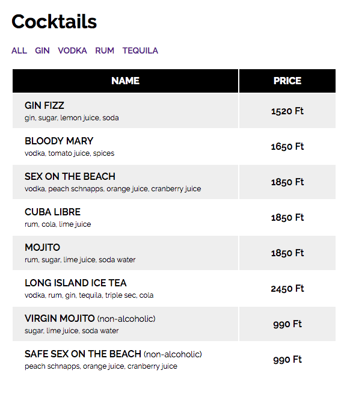

# Cocktails
---
*A filterable cocktail list*
## What to do
* Initialize a new nodejs project.
* Install both __Express__ and __EJS__ dependencies.
* Create a template file for the cocktail list
* Create a node web server to render templates

## How to do
### Back-end side
* Create a route for getting `/`
* In your server file, create a list of cocktails to mimic a database
  * Use this list and __do not__ touch it
    ```javascript
    const cocktails = [
      { name: 'GIN FIZZ', price: 1520, contains: ['gin', 'sugar', 'lemon juice', 'soda'], isAlcoholic: true },
      { name: 'BLOODY MARY', price: 1650, contains: ['vodka', 'tomato juice', 'spices'], isAlcoholic: true },
      { name: 'SEX ON THE BEACH', price: 1850, contains: ['vodka', 'peach schnapps', 'orange juice', 'cranberry juice'], isAlcoholic: true },
      { name: 'CUBA LIBRE', price: 1850, contains: ['rum', 'cola', 'lime juice'], isAlcoholic: true },
      { name: 'MOJITO', price: 1850, contains: ['rum', 'sugar', 'lime juice', 'soda water'], isAlcoholic: true },
      { name: 'LONG ISLAND ICE TEA', price: 2450, contains: ['vodka', 'rum', 'gin', 'tequila', 'triple sec', 'cola'], isAlcoholic: true },
      { name: 'VIRGIN MOJITO', price: 990, contains: ['sugar', 'lime juice', 'soda water'], isAlcoholic: false },
      { name: 'SAFE SEX ON THE BEACH', price: 990, contains: ['peach schnapps', 'orange juice', 'cranberry juice'], isAlcoholic: false },
    ];
    ```
  * Create an array for available alcohols
    ```javascript
    const alcoholList = ['gin', 'vodka', 'rum', 'tequila'];
    ```
* Pass the two lists to frontend on render
* When a user visits the application
  * with the base route (`/`), pass the cocktails list without filtering it
  * with `/?alcohol={alcholType}` route (for example `/?alcohol=gin`), filter the cocktails and pass only these that contains the selected alcohol
* For static file serving, you have to set a static folder. Here is how to do it:
  * Create a new folder in the __root__ called `static`
  * Add this line after you set up the view engine:
    ```javascript
    app.use('/static', express.static('static'));
    ```
  * Create your css file inside the `static` folder

### Front-end side
* Create a `h1` tag for title
* Create the list of selectable alcohols
* Render the cocktails with using template iteration
  * 
  * If a cocktail does not contain any alcohol, write `(non-alcoholic)` after its name
    * Do not rename any in the original list, use template conditional statement
* Add some style by following the preview or create your own style
  * Link a stylesheet from the `static` folder:
    ```html
    <link rel="stylesheet" type="text/css" href="/static/style.css">
    ```
