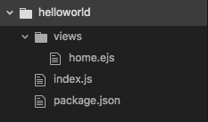

# Hello World
## Setting Up the Project
### Structure
The project structure we will be working with will look like this:

* `views/` will contain our EJS templates
* `index.js` will have our Express configuration and routes
* `package.json` will maintain our dependencies (Express and EJS)

### Initialization
Let's initialize a package.json and install both EJS and Express:
```shell
npm init -y
npm install express ejs --save
```

### Templates
* Create an empty `views` directory
* Under this directory create a file called `home.ejs`
* Copy the snippet below
```html
<!DOCTYPE html>
<html lang="en">
  <head>
    <meta charset="utf-8">
    <title>Welcome!</title>
  </head>
  <body>
    <h1>Welcome!</h1>
  </body>
</html>

```

### Rendering Views
Let's put together a simple Node + Express web server to serve up our home view
Create an `index.js` file in the __root__ folder with the following content:
```javascript
const express = require('express');
const app = express();
const PORT = 3000;

// set the view engine to ejs
app.set('view engine', 'ejs');

// home page
app.get('/', (req, res) => {
  // render `home.ejs`
  res.render('home');
});

// start express app on port 3000
app.listen(PORT, () => {
  console.log(`Listening on port ${PORT}`);
});

```

Here is what we've done:
* We use `app.set('view engine', 'ejs');` to tell express to use EJS as our templating engine
*Express will automatically look inside the views/ folder for template files*
* The `res.render()` method is used to render the view we pass it and send the HTML to the client

Let's start our brand new web server with
```shell
node index.js
```
then visit [http://localhost:3000/](http://localhost:3000/).
If there is a big welcome message in your browser, we're fine. Let's move on.

### Templates with variables
By passing in an object to the __render__ method we can make certain data available for the templates to use. Replace the `render` method with the following code:
```javascript
res.render('home', {
  title: 'Hello World',
});
```

Let's go back to our `views/home.ejs` template and see how we can access this `title` variable and render it:
```html
<!DOCTYPE html>
<html lang="en">
  <head>
    <meta charset="utf-8">
    <title><%= title %></title>
  </head>
  <body>
    <h1><%= title %></h1>
  </body>
</html>

```

Try to pass more data in the render method and render them in the home view.
🌍 Hello World application is up and running.
🎉 We are done. Nice work! 🎉
