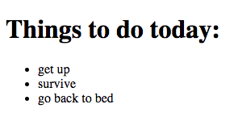

# Todos
---
*A pure list of todos.*
## What to do
* Initialize a new nodejs project
* Install both __Express__ and __EJS__ dependencies
* Create a template file
* Create a node web server to render templates

## How to do
* Create a route for getting `/`
* In your server file, create a list of todos to mimic a database
  * Use this or create your own:
    ```javascript
    const todos = [
      'get up',
      'survive',
      'go back to bed',
    ];
    ```
  * Pass the list to frontend on render
* Render the todo list with using template iteration
  * 
