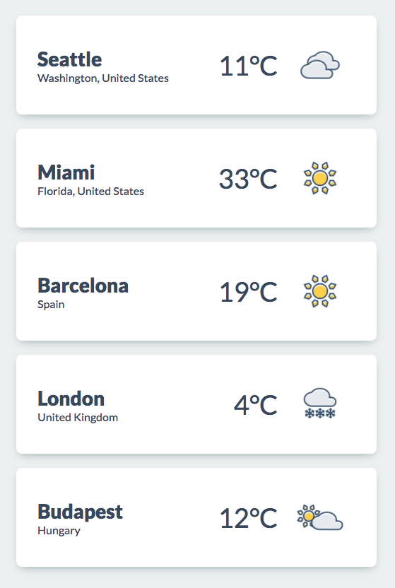
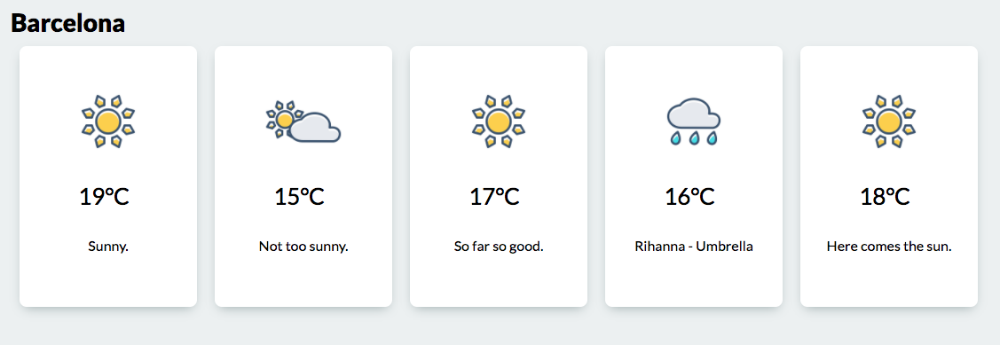

# Weather forecast
---
*A weather forecast app*
## What to do
* Initialize a new nodejs project.
* Install both __Express__ and __EJS__ dependencies.
* Create a template files for dashboard and details views
* Create a node web server to render templates

## How to do
### Back-end side
___
* In your server file, create a list of cities and forecast information to mimic a database
  * Use this list
    ```javascript
    const forecasts = [
      {
        city: 'Seattle',
        location: 'Washington, United States',
        weather: [
          { temp: 11, icon: 'cloudy', message: 'Complete Grey' },
          { temp: 11, icon: 'cloudy', message: 'Just stay in bed.' },
          { temp: 13, icon: 'cloudy', message: 'Meh...' },
          { temp: 12, icon: 'cloudy', message: 'Still meh...' },
          { temp: 13, icon: 'partly_cloudy', message: 'Not too sunny.' },
        ],
      },
      {
        city: 'Miami',
        location: 'Florida, United States',
        weather: [
          { temp: 33, icon: 'sunny', message: 'Hot.' },
          { temp: 35, icon: 'sunny', message: 'Too hot!' },
          { temp: 34, icon: 'sunny', message: 'Sunny.' },
          { temp: 34, icon: 'sunny', message: 'Beach time!' },
          { temp: 35, icon: 'sunny', message: 'Here comes the sun.' },
        ],
      },
      {
        city: 'Barcelona',
        location: 'Spain',
        weather: [
          { temp: 19, icon: 'sunny', message: 'Sunny.' },
          { temp: 15, icon: 'partly_cloudy', message: 'Not too sunny.' },
          { temp: 17, icon: 'sunny', message: 'So far so good.' },
          { temp: 16, icon: 'rainy', message: 'Rihanna - Umbrella' },
          { temp: 18, icon: 'sunny', message: 'Here comes the sun.' },
        ],
      },
      {
        city: 'London',
        location: 'United Kingdom',
        weather: [
          { temp: 4, icon: 'snowy', message: 'Go home winter.' },
          { temp: 7, icon: 'rainy', message: 'Do you have an umbrella?' },
          { temp: 10, icon: 'rainy', message: 'It\'s rainy.' },
          { temp: 9, icon: 'rainy', message: 'Meh...' },
          { temp: 11, icon: 'rainy', message: 'Meh... Again.' },
        ],
      },
      {
        city: 'Budapest',
        location: 'Hungary',
        weather: [
          { temp: 12, icon: 'partly_cloudy', message: 'It\'s cloudy.' },
          { temp: 16, icon: 'rainy', message: 'Sooo... Wet.' },
          { temp: 18, icon: 'partly_cloudy', message: 'Here comes the sun.' },
          { temp: 16, icon: 'partly_cloudy', message: 'Not too sunny.' },
          { temp: 19, icon: 'partly_cloudy', message: 'So far so good.' },
        ],
      },
    ];
    ```
* Create a route for getting `/` and render dashboard view
* Create a route for getting `/cities/{cityId}` and render details view with the selected city
  * `{cityId}` parameter can be a name (`/cities/London`) or an array index (`/cities/3`). It's up to you.
* Set up the `static` folder to serve static files (stylesheets and images). Check previous exercise if you don't know how to do.

### Front-end side
___
The weather icons are available [here](https://github.com/green-fox-academy/teaching-materials/tree/master/workshop/templating/assets).
Get a font from __Google Fonts__ and add it into the header. Here is how to use __Lato__ font family:
```html
<link href="https://fonts.googleapis.com/css?family=Lato:400,900" rel="stylesheet">
```
#### Dashboard view

* List all cities with the "current" forecast information (It's the first item from the weather's array of the city)
* A weather card is clickable and it redirects the user to the city's detailed view.

#### Detailed view

* Show all forecast information of this city.
